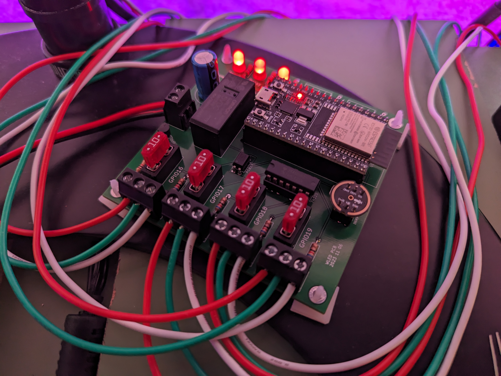

# wled-controller

A controller board for wled with the following features

* ESP32 DevKitC pin layout
* Relay switched LED supply
* 4 level shifted led outputs
* 2 buttons
* Indicator LEDs for 5v in, Relay and 5v out
* INMP441 Microphone module connection
* Mini automotive fuses

